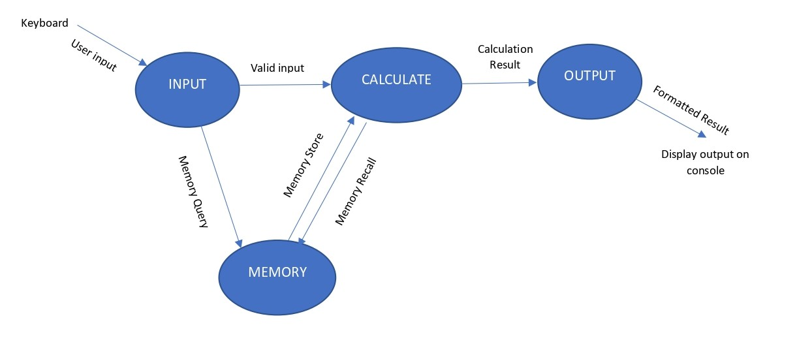
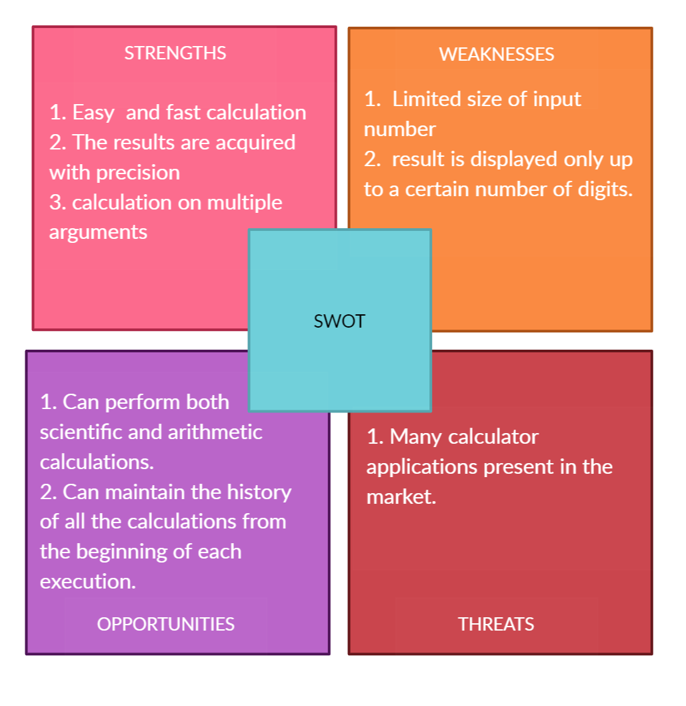

# Introduction
Calculator is the best friend for all of us when it comes to solving any mathematical problems.The program is designed to act like a “handheld calculator” with the usual standard functions like addition, subtraction, multiplication, division, exponentiation.

# Environment and Interface Requirements
This section describes the external influences imposed on the calculator program.

## Hardware Requirements
The program shall be usable on any system which supports the python interpretor and shall not require any particular hardware.

## Software Requirements
The program shall be written in Python scripting language.The program shall use only standard python  modules to perform mathematical calculations.

## Human Interfaces
The console is the interface being used. Once the program started, it shall display a prmpt >>.The user can then type a sequence of numbers and operators similar to regualr calculator. The program will display the calculated answer to the entered problem in the line following the input line.

# Data flow Diagram
 The data flow diagram which identifies the major functions required of the calculator program and shows their relationship to each other.

 

 # Major Operations Performed

 ## 1. Input
 Accept input from the user via the terminal, validate that input, and then send that input to the calculate function. All user interaction with the program will occur through this function.

 ## 2. Calculate
 Perform calculations based on the operator provided and update the result.

 ## 3. Output
 Display the calculated result in the terminal.

 # Function Used in the Application

 # SWOT Analysis

 

 # High-Level Requirements
 # Low-Level Requirements